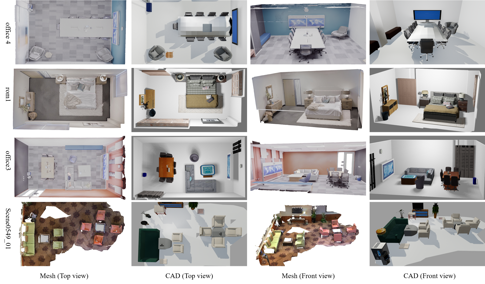

<div align="center">
 
## POSITION: Open-world 3D Scene CAD Recomposition
<div align="center">
    
</div>

</div>

<div align="center">
<a href="">Rongkun Yang</a><sup>1</sup>, <a href="">Hongda Liu</a><sup>1</sup>, <a href=""> Yijun Chen</a><sup>1</sup>, <a href="">Sheng Ao</a><sup>1</sup>, <a href="">Yongjian Zhang</a><sup>1</sup>,  <a href="">Longguang Wang</a><sup>1</sup>, <a href="">Kaiwen Xue</a><sup>2</sup>,  <a href="">Shunbo Zhou</a><sup>2</sup>,  <a href="">Yulan Guo</a><sup>1</sup>

<sup>1</sup>Sun Yat-sen University,  <sup>2</sup>Huawei Cloud Computing Technologies Co., Ltd. 

[//]: # (<sup>3</sup>Aalto University <sup>4</sup>Australian National University <sup>5</sup>Linköping University)
</div>


<div align="center">
 
<a href='' target="_blank"></a> 


 </div>


### News

[//]: # (* **30 May 2025**: [POSITION]&#40;&#41; released on arXiv. 📝)

[//]: # (* **30 May 2024**: Code released. 💻)

### Abstract

3D scene CAD recomposition aims to reconstruct a given scene with
CAD models retrieved from a database to simulate the original geometry and arrangement. 
While recent methods produce satisfactory results on closed-set databases with limited types 
of objects, they cannot be applied in the real world with diverse objects that are unseen in 
the training set. In this paper, we propose POSITION, an open-world 3D scene CAD recomposition 
method to reconstruct the 3D scene with CADs retrieved from an open-set database. 
Our POSITION consists of three steps: Firstly, we extract open-world multi-modal object representations from a captured 3D scene. Secondly, on top of the extracted representations, we propose a training-free multi-modal coarse-to-fine retrieval method to retrieve CADs that visually, geometrically and semantically match the objects. Thirdly, we present a physical plausible pose alignment method to adjust retrieved CAD models to maintain consistent geometry and layout with the observation. Extensive experiments on the Replica and ScanNet datasets demonstrate the effectiveness of our proposed POSITION.


### Qualitative results

<br>

<div align="center">
    
</div>


## Installation guide

Kindly check [Installation guide](./docs/Installation.md) on how to setup the Conda environment and to download the checkpoints, the pre-computed class agnostic masks, and the ground truth masks.

## Data Preparation

Kindly check [Data Preparation guide](./docs/Data_prep.md) on how to prepare ScanNet200 and Replica datasets.


## Run

### 1. RGB-D mapping for 3D scene CAD recomposition
#### Replica
```bash
SCENE_NAME=office0
bash scripts/replica/online/${SCENE_NAME}.sh

```

### 2. 3D instance segmentation with multi-view image selection for CAD recomposition

## Detail Parameter Explain
Please refer to [Parameter explain guide](./docs/Parameter_explain.md) on how to adjust parameter for custom data.


